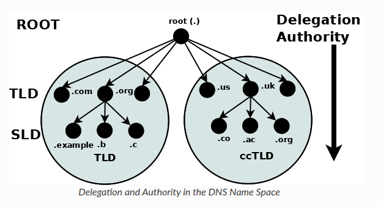

## How configure DNS with Bind9

In this section, I want to learn about bind9 DNS service and through hands-on practice I want to have a deep dive on DNS configuration, and at the end include on all my labs DNS configuration easily and all possibilities that it can give me.

#

### Documentation

- [Bind9 - Official documentation](https://bind9.readthedocs.io/en/v9.20.23/)
- [Bind9 - How Domain tree is organized](https://bind9.readthedocs.io/en/v9.20.23/chapter1.html#the-domain-name-system-dns)
- [ISC - Documentation](https://kb.isc.org/docs/isc-packages-for-bind-9)
- [Build bind9](https://kb.isc.org/docs/aa-00768)
- [DNS root-servers](https://root-servers.org/)
- [ICCAN](https://www.icann.org/)

### Domain tree structure diagram



- Domain and FQDN

```sh
    example.com     # domain name
    example.com.    # FQDN
```

> DNS Tree start with "." (dot) as a root node, on domain notation it is omitted, but in FQDN notation must write it.
