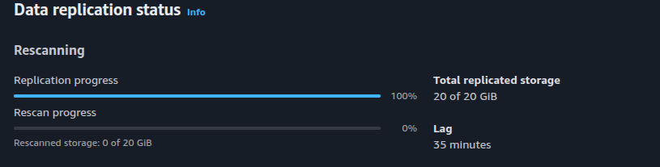
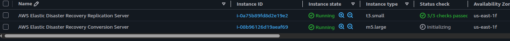

# AWS Elastic Disaster Recovery

- [AWS -DRS](https://docs.aws.amazon.com/drs/latest/userguide/what-is-drs.html)

## Documentação

- [gcc](https://docs.aws.amazon.com/drs/latest/userguide/agent-install-linux-errors.html#error-gcc-not-found)
- [Kernel](https://docs.aws.amazon.com/drs/latest/userguide/troubleshooting/DRS-INST-003)
- [Criar Serviço Systemd](https://medium.com/@benmorel/creating-a-linux-service-with-systemd-611b5c8b91d6)
- [Systemd Documentation](https://systemd.io/)
- [[YT] What is systemd](https://www.youtube.com/watch?v=TGfXfuC3680&t)

### Como excutar

1. No diretorio src execute os comandos abaixo:

> imagem no vagrantfile é local

```sh
vagrant up
scp *.service *.sh vagrant@192.168.56.22:/scripts
ssh vagrant@192.168.56.22 'ls -la /scripts'

```

2. Acesse a vm e execute o `/scripts/script.sh`

- Esse script instala o `apache2` e o `events.service` que escreve a cada 60 segundos no `/data/events.log`

  ```sh
  2026-10-04 19:56:23 - CPU: Intel(R)Core(TM)i3-10100FCPU@3.60GHz
  ```

- Verificar versão kernel e readers [Erro Kernel](https://docs.aws.amazon.com/drs/latest/userguide/troubleshooting/DRS-INST-003)

  ```sh
  uname -r
  dpkg -l | grep linux-image
  dpkg -l | grep linux-headers
  ```

- Atualizar headers

  ```sh
  apt update \
  apt install -y \
    linux-image-amd64 \
    linux-headers-amd64

  ```

- Validar tráfego do source para o DRS

  ```
  # Validar
  ss -ntp
  tcpdump -nn port 1500
  ```

## Performar o Drill

- Serviços enabled rodando, para entrar em execução assim que o servidor drill iniciar:
- log do corte (Core local e xeon aws)

  ```log
  2026-10-04 20:33:23 - CPU: Intel(R)Core(TM)i3-10100FCPU@3.60GHz
  2026-10-04 20:34:23 - CPU: Intel(R)Core(TM)i3-10100FCPU@3.60GHz
  2026-10-04 20:42:52 - CPU: Intel(R)Xeon(R)Platinum8275CLCPU@3.00GHz
  2026-10-04 20:43:52 - CPU: Intel(R)Xeon(R)Platinum8275CLCPU@3.00GHz
  ```

- Período desligado, nesse caso entre cair e voltar foram 33 minutos

  ```log
  2026-10-04 20:40:23 - CPU: Intel(R)Core(TM)i3-10100FCPU@3.60GHz
  2026-10-04 21:13:27 - CPU: Intel(R)Core(TM)i3-10100FCPU@3.60GHz
  ```

- Servidour source desligado por 30 minutos, gerando lag
  
- Rescan após religar
  

## Recovery e failback

- [Failback Pre requisitos](https://docs.aws.amazon.com/drs/latest/userguide/failback-performing.html#failback-performing-prerequesites)

- Ao inicial o recovery inicia um conversion server
  

### Failback

- On-premisse é iniciado via ISO
  1. Desligue a VM
  2. Monte o ISO e realize o boot pelo ISO
  3. Para VirtualBox, Use os comandos do script `vbox_failback_command.sh`especialmente para o input das credênciais temporárias.
