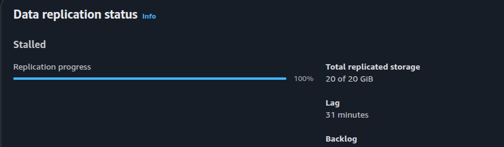

### Documentação

- [gcc](https://docs.aws.amazon.com/drs/latest/userguide/agent-install-linux-errors.html#error-gcc-not-found)
- [Kernel](https://docs.aws.amazon.com/drs/latest/userguide/troubleshooting/DRS-INST-003)
- [Criar Serviço Systemd](https://medium.com/@benmorel/creating-a-linux-service-with-systemd-611b5c8b91d6)
- [Systemd Documentation](https://systemd.io/)
- [[YT] What is systemd](https://www.youtube.com/watch?v=TGfXfuC3680&t)
- [AWS -DRS](https://docs.aws.amazon.com/drs/latest/userguide/what-is-drs.html)

### Como excutar

- no diretorio src execute os comandos abaixo:
  > imagem no vagrantfile é local

```sh
vagrant up
scp *.service *.sh vagrant@192.168.56.22:/scripts
ssh vagrant@192.168.56.22 'ls -la /scripts'

```

- acesse a vm e execute o `/scripts/script.sh`
- Esse script instala o `apache2` e o `events.service` que escreve a cada 60 segundos no `/data/events.log`

```sh
2026-10-04 19:56:23 - CPU: Intel(R)Core(TM)i3-10100FCPU@3.60GHz
```

- Verificar versão

```
uname -r
dpkg -l | grep linux-image
dpkg -l | grep linux-headers
```

- Atualizar headers

```
apt update \
apt install -y \
  linux-image-amd64 \
  linux-headers-amd64

```

- Validar trafego

```
# Porta
ss -ntp
tcpdump -nn port 1500
```

- inicio 08:29

### Drill

- Serviços enabled rodando:
- log do corte (Core local e xeon aws)

```
2026-10-04 20:33:23 - CPU: Intel(R)Core(TM)i3-10100FCPU@3.60GHz
2026-10-04 20:34:23 - CPU: Intel(R)Core(TM)i3-10100FCPU@3.60GHz
2026-10-04 20:42:52 - CPU: Intel(R)Xeon(R)Platinum8275CLCPU@3.00GHz
2026-10-04 20:43:52 - CPU: Intel(R)Xeon(R)Platinum8275CLCPU@3.00GHz
```

- Período desligado

```log
2026-10-04 20:40:23 - CPU: Intel(R)Core(TM)i3-10100FCPU@3.60GHz
2026-10-04 21:13:27 - CPU: Intel(R)Core(TM)i3-10100FCPU@3.60GHz
```

- Servidour source foi desligado por 30 minutos, gerando lag
  
- Rescan após religar
  

### Recovery e failback

- Ao inicial o recovery inicia um conversion server
  

- Cloud

```sh
2026-10-04 21:19:29 - CPU: Intel(R)Core(TM)i3-10100FCPU@3.60GHz
2026-10-04 21:27:47 - CPU: Intel(R)Xeon(R)Platinum8275CLCPU@3.00GHz
2026-10-04 21:28:47 - CPU: Intel(R)Xeon(R)Platinum8275CLCPU@3.00GHz
2026-10-04 21:29:47 - CPU: Intel(R)Xeon(R)Platinum8275CLCPU@3.00GHz
2026-10-04 21:30:47 - CPU: Intel(R)Xeon(R)Platinum8275CLCPU@3.00GHz
```

- local

```
2026-10-04 21:13:27 - CPU: Intel(R)Core(TM)i3-10100FCPU@3.60GHz
2026-10-04 21:14:29 - CPU: Intel(R)Core(TM)i3-10100FCPU@3.60GHz
2026-10-04 21:15:29 - CPU: Intel(R)Core(TM)i3-10100FCPU@3.60GHz
2026-10-04 21:16:29 - CPU: Intel(R)Core(TM)i3-10100FCPU@3.60GHz
2026-10-04 21:17:29 - CPU: Intel(R)Core(TM)i3-10100FCPU@3.60GHz
2026-10-04 21:18:29 - CPU: Intel(R)Core(TM)i3-10100FCPU@3.60GHz
2026-10-04 21:19:29 - CPU: Intel(R)Core(TM)i3-10100FCPU@3.60GHz
2026-10-04 21:32:34 - CPU: Intel(R)Core(TM)i3-10100FCPU@3.60GHz
2026-10-04 21:33:36 - CPU: Intel(R)Core(TM)i3-10100FCPU@3.60GHz
```

### Pós-failback
