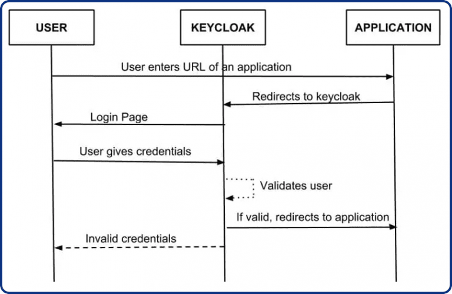

# Keycloack

#

### Objetivos :

- Compreender o funcionamento desse gerenciador de identidades
- Ter uma compreensão melhor das configurações de AuthN e AuthZ
- Implementar um laboratório de SSO
- Integrar ao lab de LDAP
- Integrar aos ambientes/labs de kubernetes.

#

### Documentações e fontes de estudo

- [Documentação Oficial](https://www.keycloak.org/)

- **Artigos e posts sobre keycloack**
  - [Um Guia para o Keycloak e suas vulnerabilidades de segurança](https://vantico.com.br/guia-para-keycloak-e-vulnerabilidades/)

#

### Fluxo de autenticação

