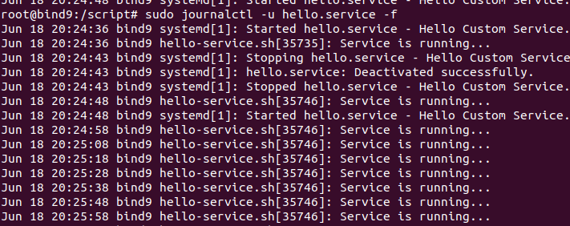
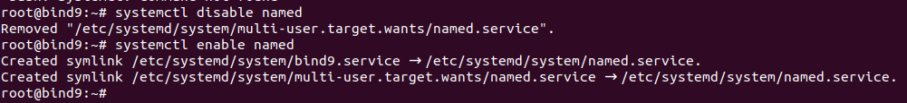

### This section is about service behavior and configure on linux system

> distro: Debian 12 bookworm
> Service is a systemd unit file that defines how a service should start, stop, restart and behave

### Documentation

[Systemd Documentation](https://systemd.io/)
[[YT] What is systemd](https://www.youtube.com/watch?v=TGfXfuC3680&t)

### How to create example service

1. touch file: `/usr/local/bin/hello-service.sh`
2. Content

```sh
#!/bin/bash
while true; do
  echo "Service is running..."
  sleep 10
done
```

3. Make it executable: `chmod +x /usr/local/bin/hello-service.sh `
4. Create service unit `vim /etc/systemd/system/hello.service`
5. Content

```sh
[Unit]
Description=Hello Custom Service
After=network.target
Documentation=https://github.com/Adenilson365/devops-practice/blob/main/linux/src/service/README.md

[Service]
Type=simple
ExecStart=/usr/local/bin/hello-service.sh
Restart=always
RestartSec=5
User=root

[Install]
WantedBy=multi-user.target
```

6. Reload systemd-daemon `systemctl daemon-reload`

7. Start the service `systemctl start hello.service` and check status `systemctl status hello.service`
8. Enable service on boot `systemctl enable hello.service` and restart it `systemctl restart hello.service`
9. See service work `sudo journalctl -u hello.service -f`
   

### Alias

In some cases you need that service answer for old name or popular name. You can add alias for it.

```sh
[Install]
WantedBy=multi-user.target
Alias=bind9.service
```

- You need disabled and enabled service again, because systemd needs to creade symlink.
  
