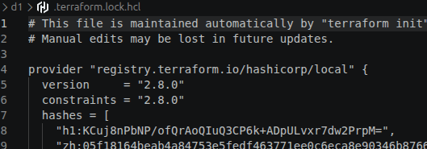

### Review variables and configure blocks.

- Version constraints table
  | Constraint | Meaning | Example |
  | ---------- | ---------------------------- | ------------------------------------------ |
  | `= 1.5.0` | Exactly this version | Only `1.5.0` |
  | `!= 1.5.0` | Anything except this version | `1.4.0`, `1.6.0`, etc. |
  | `> 1.5.0` | Greater than | `1.5.1`, `1.6.0`, `2.0.0` |
  | `>= 1.5.0` | Greater than or equal | `1.5.0`, `1.6.0`, `2.0.0` |
  | `< 2.0.0` | Lower than | `1.9.9`, `1.8.0`, etc. |
  | `<= 2.0.0` | Lower than or equal | Up to `2.0.0` |
  | `~> 1.5` | Compatible version | `1.5`, `1.6`, `1.9`, but not `2.0` |
  | `~> 1.5.0` | Compatible patch versions | `1.5.0`, `1.5.1`, `1.5.9`, but not `1.6.0` |

- We can also combine contraints, as shown below:

```sh
terraform {
required_version = ">= 1.10.0, < 2.0.0"

required_providers {
    aws = {
    source  = "hashicorp/aws"
    version = ">= 6.0.0, < 7.0.0"
    }
}
}
```

> This means that Terraform can use any AWS provider version greater than or equal to 6.0.0 and lower than 7.0.0

6.29.0 ❌
6.30.0 ✅
6.35.1 ✅
6.99.0 ✅
7.0.0 ❌

However, our terraform.lock.hcl file stores the provider current version installed by Terraform. If we want to upgrade version that still satisfies configured constraints we need to run `terraform init --upgrade`



- after applying the upgrade

```json
provider "registry.terraform.io/hashicorp/local" {
  version     = "2.9.0"
  constraints = "~> 2.8"
```

- we can also perform downgrade by changing the versions constraitns in the provider block, for example: "constraints= "<=2.8.0"

```sh
terraform {
  required_providers {
    local = {
      source  = "hashicorp/local"
      version = "<= 2.8"
    }
  }
}
```

```json
provider "registry.terraform.io/hashicorp/local" {
  version     = "2.8.0"
  constraints = "<= 2.8.0"
```

- When I applied a bounded version constraint, I noticed that terraform selected the minor version, or left version between them.

```sh
provider "registry.terraform.io/hashicorp/local" {
  version     = "2.7.0"
  constraints = "2.7.0, < 2.9.0"
```

- In this case, I made a mistake, I write `=2.7.0`, It allow terraform just select version equal, in other words, I set version. If I use >= instead, terraform can select version in the range beetwhen them.

```sh
provider "registry.terraform.io/hashicorp/local" {
  version     = "2.9.0"
  constraints = ">= 2.7.0, <= 2.9.0"
```

- Terraform generally select the newest version available that satisfies all constraints
