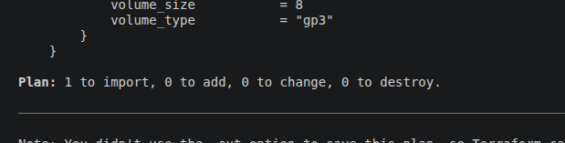
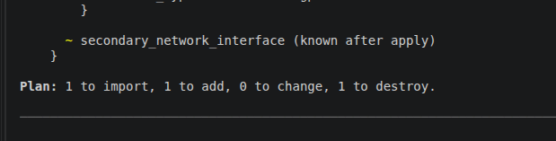

# Dia 10 — Terraform Import

A importação associa uma instância que já existe na AWS a um endereço no Terraform State, permitindo gerenciá-la pelo código. Neste laboratório, o fluxo é: **consultar com um data source → visualizar os atributos → criar o bloco `resource` → importar → revisar o plano**.

O comando `terraform import` registra a associação no estado; ele não cria outra EC2 nem escreve o bloco `resource` automaticamente. Consulte a [documentação de importação pela CLI](https://developer.hashicorp.com/terraform/cli/import).

## Antes de começar

O [main.tf](./main.tf) contém a versão final do exercício: `data.aws_instance.out`, o output `instance_public_ip` e `aws_instance.import`. Os passos abaixo mostram como construir essa configuração desde o início, em um estado novo para o laboratório. Se já concluiu a importação, siga diretamente para a conferência do passo 5; não remova recursos já gerenciados para repetir a etapa de consulta.

Use credenciais AWS para a conta da instância e confirme os IDs no seu ambiente. O [provider.tf](./provider.tf) define:

```hcl
terraform {
  required_providers {
    aws = {
      source  = "hashicorp/aws"
      version = "6.64.0"
    }
  }
}

provider "aws" {
  region = "us-east-1"
}
```

Partindo da pasta `terraform` do repositório:

```bash
cd src/d10
terraform init
terraform workspace show
terraform state list
```

Confirme o backend e o workspace: a EC2 não deve estar associada a outro endereço de recurso gerenciado ou a outro estado.

## 1. Criar o data source da instância existente

Comece o `main.tf` apenas com a consulta e o output, mantendo o provider no arquivo separado. Informe o ID da EC2 que deseja importar:

```hcl
data "aws_instance" "out" {
  instance_id = "i-0c091182ec44b4cca"
}

output "instance_public_ip" {
  value = data.aws_instance.out.public_ip
}
```

O data source busca atributos como AMI, tipo da instância, subnet, security groups, chave SSH e tags. Ele permite inspecionar a EC2 sem assumir o gerenciamento de seu ciclo de vida. Veja a [referência do data source `aws_instance`](https://registry.terraform.io/providers/hashicorp/aws/latest/docs/data-sources/instance).

Nesta etapa, **ainda não adicione o bloco `resource`**. Execute:

```bash
terraform plan
terraform apply
```

Revise o plano antes de confirmar: nesta fase, ele deve apenas ler os dados e registrar o output, sem criar, alterar ou destruir recursos. O `apply` persiste a consulta no estado, permitindo usar `terraform state show` no próximo passo. Um `plan` isolado não persiste essa consulta no estado usado pelo comando.

## 2. Visualizar as informações do data source

Com a consulta registrada no estado:

```bash
terraform state show data.aws_instance.out
```

O argumento é o endereço do **data source**, e não o ID da EC2. Exemplo ilustrativo de parte da saída, usando os valores do código do laboratório:

```hcl
# data.aws_instance.out:
data "aws_instance" "out" {
  id                     = "i-0c091182ec44b4cca"
  ami                    = "ami-0354c98ae10b02961"
  instance_type          = "t2.micro"
  subnet_id              = "subnet-0fd0c237b3e70c7d7"
  vpc_security_group_ids = ["sg-06ecf3a754aac7d96"]
  key_name               = "kp-linux-dev"

  tags = {
    Name = "out"
  }
}
```

Use os valores retornados na sua consulta, inclusive as tags existentes. Essa saída serve como referência; não copie atributos calculados, como `id`, para o bloco `resource`. Os esquemas de data source e resource são diferentes.

## 3. Criar o bloco `resource` com os atributos consultados

Acrescente ao `main.tf` a configuração que representará a mesma instância. Para os valores ilustrados acima:

```hcl
resource "aws_instance" "import" {
  ami           = "ami-0354c98ae10b02961"
  instance_type = "t2.micro"
  region        = "us-east-1"

  subnet_id              = "subnet-0fd0c237b3e70c7d7"
  vpc_security_group_ids = ["sg-06ecf3a754aac7d96"]
  key_name               = "kp-linux-dev"

  tags = {
    Name = "out"
  }
}
```

O endereço será `aws_instance.import`. Inicialmente, reproduza os atributos e tags existentes; adicione outros argumentos configuráveis caso sejam necessários para representar sua EC2. Consulte a [referência do recurso `aws_instance`](https://registry.terraform.io/providers/hashicorp/aws/latest/docs/resources/instance).

Valide a configuração:

```bash
terraform fmt
terraform validate
```

**Ainda não execute `terraform apply`.** Antes da importação, esse novo endereço não está associado à EC2 existente, e o Terraform pode propor criar outra instância.

## 4. Importar a instância para o recurso declarado

Use o endereço criado e o `id` obtido na consulta:

```bash
terraform import aws_instance.import i-0c091182ec44b4cca
```

Nesse comando, `aws_instance.import` é o destino no Terraform e `i-0c091182ec44b4cca` identifica a EC2 na AWS. A associação é gravada imediatamente no estado, sem precisar de um `apply` posterior para concluir a importação. Veja a [referência de `terraform import`](https://developer.hashicorp.com/terraform/cli/commands/import).

## 5. Conferir o estado e o próximo plano

```bash
terraform state list
terraform state show aws_instance.import
terraform plan
```

Após o sucesso, a lista deve incluir:

```text
aws_instance.import
data.aws_instance.out
```

Os dois endereços têm papéis diferentes: `data.aws_instance.out` consulta a EC2 e `aws_instance.import` a gerencia. A presença do data source não significa que a instância foi importada duas vezes.

O resultado desejado inicialmente é nenhuma alteração na instância. Se o plano indicar mudanças, compare o código com os atributos importados. Uma indicação de substituição (`-/+` ou `+/-`, com campos marcados como `forces replacement`) exige revisar os argumentos antes de aplicar.

## 6. Adicionar tags de governança após importar

**É possível adicionar ou alterar as tags de `aws_instance` sem destruir ou recriar a EC2.** Uma mudança apenas no mapa `tags` é aplicada na própria instância (_update in-place_), mantendo seu ID. Tags permitem registrar informações como responsável, ambiente e centro de custo; veja as [orientações da AWS sobre tags de EC2](https://docs.aws.amazon.com/AWSEC2/latest/UserGuide/Using_Tags.html).

Por exemplo, substitua o mapa `tags` dentro de `aws_instance.import` por:

```hcl
tags = {
  Name        = "out"
  Managed-by  = "Terraform"
  imported    = "true"
  Environment = "lab"
  Owner       = "devops"
  CostCenter  = "estudos"
}
```

`Managed-by` e `imported` já fazem parte do código atual do laboratório. As demais são exemplos que você pode adaptar à sua governança. Preserve no mapa as tags existentes que deseja manter: tags gerenciadas omitidas podem ser removidas no próximo `apply`.

Confira o plano:

```bash
terraform plan
```

Se somente as tags precisarem mudar, a ação esperada para a instância será semelhante a:

```text
# aws_instance.import will be updated in-place
~ resource "aws_instance" "import" {
    id = "i-0c091182ec44b4cca"
    # Atualizações em tags e tags_all; demais atributos omitidos.
  }

Plan: 0 to add, 1 to change, 0 to destroy.
```

Esse trecho é ilustrativo. Confirme que o plano real apresenta somente as alterações pretendidas e então execute:

```bash
terraform apply
```

Revise novamente o plano apresentado e confirme. A importação por si só não aplica as tags declaradas no código; essa atualização acontece no `apply`. A garantia de não recriar vale para a alteração das tags da instância: outras mudanças simultâneas, como uma troca de AMI, podem exigir substituição. As tags de volumes EBS são configurações separadas.

## 7. Usar o bloco `import` (Terraform 1.5+)

O bloco `import` registra a intenção de importação no código e permite revisá-la com `terraform plan`. A associação é efetivada no `apply`.

Este fluxo substitui o comando do passo 4: mantenha a consulta pelo data source e o `resource` preparado nos passos 1 a 3. Se você já importou a EC2 no mesmo endereço, o bloco não repete a operação enquanto ela permanecer no estado; não é necessário remover a associação para experimentar a sintaxe.

### Declarar a importação

Crie um arquivo `imports.tf` no mesmo diretório do `main.tf`:

```hcl
import {
  to = aws_instance.import
  id = "i-0c091182ec44b4cca"
}
```

- `to`: endereço do bloco `resource` de destino, sem aspas.
- `id`: identificador da EC2 obtido na consulta do passo 2.

### Revisar e aplicar

```bash
terraform plan
```

Para uma EC2 ainda não importada, com configuração alinhada à infraestrutura, o resumo esperado é:

```text
Plan: 1 to import, 0 to add, 0 to change, 0 to destroy.
```

Se as tags de governança do item 6 já estiverem no código, o plano também poderá propor sua atualização. Revise todas as ações antes de executar:

```bash
terraform apply
```

Confira o plano apresentado e confirme. Depois, verifique a associação:

```bash
terraform state show aws_instance.import
terraform plan
```

- Se estiver tudo ok:



- Caso contenha alguma informação desalinhada, no output do plan é possível análisar a diferença:



Após concluir, você pode manter o bloco `import` como histórico ou removê-lo; preserve o bloco `resource`, que continua definindo o gerenciamento da EC2. Consulte o [fluxo oficial de importação com bloco `import`](https://developer.hashicorp.com/terraform/language/import/single-resource).

### terraform plan -generate-config-out=import.tf

> Com esse comando consigo gerar o output com as informações sobre o recurso, apartir de um bloco import

```json
  import {
    to = aws_instance.import1
    id = "i-0c028363598d126d8"
  }
```

- aplico o comando `terraform plan -generate-config-out=import.tf` no import.tf terei o bloco do recurso com todas as informações.
