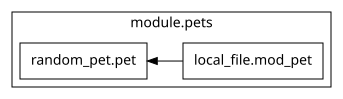

# Dias 6 a 9 — Gerenciamento de estado no Terraform

## O que é o estado?

O **Terraform State** associa os endereços dos recursos na configuração aos objetos gerenciados pelo Terraform. Também registra atributos e metadados usados para acompanhar esses recursos.

Os arquivos `.tf` descrevem o estado desejado. O state registra o que o Terraform conhece dos objetos gerenciados. Durante um `terraform plan` normal, o Terraform consulta os providers para atualizar sua visão dos recursos e compara essas informações com a configuração, propondo criações, alterações ou destruições quando necessário. O `terraform apply` executa as mudanças aprovadas e atualiza o estado.

Por padrão, o estado é armazenado localmente no arquivo `terraform.tfstate`. Consulte a [documentação de estado](https://developer.hashicorp.com/terraform/language/state).

## Estado remoto (Remote State)

Um backend remoto permite armazenar o estado fora da máquina do desenvolvedor, por exemplo, em um bucket S3. O HCP Terraform também oferece armazenamento remoto de estado. Isso permite que a equipe trabalhe com uma fonte compartilhada de informações sobre os recursos gerenciados.

O armazenamento remoto deve ter controle de acesso e recuperação de versões. O suporte a bloqueio de estado (*state locking*) depende do backend e de sua configuração; quando disponível, ele impede gravações concorrentes que poderiam comprometer o estado.

Neste laboratório, o `main.tf` não declara um backend remoto: o estado usa o armazenamento local padrão.

## Consultando o estado

Execute os comandos no diretório `src/d6-7-8-9`, após inicializar o laboratório com `terraform init`. Os exemplos de consulta pressupõem que os recursos já foram criados com `terraform apply` e estão registrados no estado selecionado.

| Comando | Finalidade |
| --- | --- |
| `terraform state list` | Lista os endereços dos recursos registrados no estado. |
| `terraform show` | Exibe o último snapshot do estado em formato legível. |
| `terraform show <arquivo>` | Exibe um arquivo de estado ou um plano salvo. |
| `terraform state show '<endereco>'` | Exibe os atributos de uma instância de recurso no estado. |

Esses comandos consultam informações registradas; não atualizam os recursos consultando os providers. Veja a [referência de `terraform show`](https://developer.hashicorp.com/terraform/cli/commands/show).

O módulo `pets` deste laboratório usa `count = 2`. Após a criação, os endereços esperados são:

```text
module.pets[0].local_file.mod_pet
module.pets[0].random_pet.pet
module.pets[1].local_file.mod_pet
module.pets[1].random_pet.pet
```

Para inspecionar o arquivo da primeira instância:

```bash
terraform state show 'module.pets[0].local_file.mod_pet'
```

O argumento é o **endereço Terraform**, e não o atributo `id` retornado pelo provider. `module.pets[0]` identifica a primeira instância do módulo, e `local_file.mod_pet` identifica o recurso dentro dela. As aspas simples protegem os colchetes contra interpretação pelo shell.

## Visualizando dependências

`terraform graph` gera um grafo de dependências em formato DOT. Por padrão, apresenta as relações entre os recursos da configuração; não é uma representação completa do conteúdo do state. Com o comando `dot` do [Graphviz](https://graphviz.org/) instalado, gere um SVG:

```bash
terraform graph | dot -Tsvg > graph.svg
```

Neste laboratório, `local_file.mod_pet` depende de `random_pet.pet`, pois usa seu atributo `id` como conteúdo do arquivo. Consulte a [referência de `terraform graph`](https://developer.hashicorp.com/terraform/cli/commands/graph).



## Refatorando com `terraform state mv`

Renomear um bloco ou mover um recurso para um módulo altera seu endereço. Sem informar essa mudança ao Terraform, o plano pode propor destruir o objeto associado ao endereço antigo e criar outro no novo endereço.

O comando correto é `terraform state mv '<origem>' '<destino>'`. Ele altera a associação no estado imediatamente, mas não edita os arquivos `.tf` nem renomeia o objeto no provider. Origem e destino devem ser compatíveis; para recursos, o tipo deve permanecer o mesmo.

Por exemplo, **em uma migração hipotética** de um recurso da raiz para a primeira instância do módulo `pets`, após ajustar a configuração:

```bash
terraform state mv 'random_pet.pet' 'module.pets[0].random_pet.pet'
terraform plan
```

Esse exemplo só se aplica se a origem existir no estado e o destino estiver livre. Na configuração atual, os recursos já estão no módulo. Revise o plano para confirmar o resultado: alterações nos atributos ainda podem exigir recriação. Em equipe, coordene a edição do código e a movimentação do estado para evitar execuções intermediárias. Veja a [referência de `terraform state mv`](https://developer.hashicorp.com/terraform/cli/commands/state/mv).

### Alternativa declarativa: bloco `moved`

A partir do Terraform 1.1, é possível registrar a refatoração no código com um bloco `moved`. Para a mesma migração hipotética, adicione ao módulo raiz:

```hcl
moved {
  from = random_pet.pet
  to   = module.pets[0].random_pet.pet
}
```

Essa é uma alternativa ao comando manual para a mesma mudança: permite versionar a intenção e revisá-la no plano, com a movimentação do estado efetivada no `apply`. Consulte a [documentação de refatoração de módulos](https://developer.hashicorp.com/terraform/language/modules/develop/refactoring).

## Solicitando a recriação de um recurso

Use `-replace`, disponível desde o Terraform 0.15.2, para solicitar a substituição de uma instância. Primeiro, inspecione o plano:

```bash
terraform plan -replace='module.pets[0].local_file.mod_pet'
```

Para executar, solicite a substituição novamente no `apply`, revise o plano apresentado e confirme:

```bash
terraform apply -replace='module.pets[0].local_file.mod_pet'
```

Um `plan` sem `-out` não salva a solicitação para um `apply` posterior. Neste exemplo, o arquivo local será substituído; o recurso que gera o nome do pet não foi selecionado para substituição.

O comando `terraform taint '<endereco>'` está **deprecated**. Ele marca o recurso no estado para substituição no próximo plano. A opção `-replace` permite revisar essa intenção e seus efeitos antes de aplicar. Consulte a [referência de `taint` e sua substituição por `-replace`](https://developer.hashicorp.com/terraform/cli/commands/taint).

Já `terraform untaint '<endereco>'` remove uma marcação `tainted` existente quando o recurso foi verificado e está funcional. Ele não desfaz uma substituição já executada nem cancela a opção `-replace`. Veja a [referência de `terraform untaint`](https://developer.hashicorp.com/terraform/cli/commands/untaint).

## Cuidados com o estado

- Evite editar o state manualmente; use os comandos do Terraform para alterar suas associações.
- Mantenha uma cópia recuperável antes de operações como `state mv`.
- Não versione `terraform.tfstate`, seus backups ou planos salvos: eles podem conter dados sensíveis.
- Marcar um valor como `sensitive` oculta sua exibição em algumas saídas, mas não o remove do estado. Proteja também exportações como `terraform show -json`.
- Revise o `terraform plan` após refatorações e antes de aplicar mudanças.

Consulte as orientações sobre [dados sensíveis no Terraform](https://developer.hashicorp.com/terraform/language/manage-sensitive-data).
